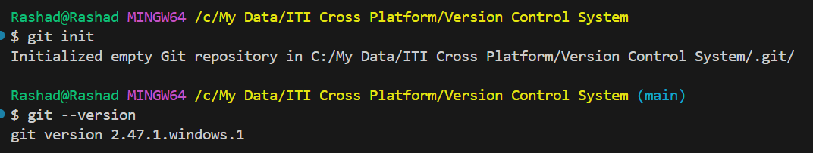

## 📝 Homework Exercises – Version Control (Git & GitHub)

### 📌 Exercise 1: Install & Initialize

**Objective:** Set up Git on your local machine.

- Install Git if not already installed.
- Run `git --version` to verify installation.
- Create a new folder, navigate to it in your terminal.
- Initialize a Git repository using `git init`.



---

### 📌 Exercise 2: First Commit

**Objective:** Practice basic commands.

- Create a new file called `hello.txt` and add some content.
- Run `git status` to see changes.
 --> 

- Add the file using `git add hello.txt`
 --> 

- Commit it using `git commit -m "Initial commit with hello.txt"`
 --> 

---

### 📌 Exercise 3: Using .gitignore

**Objective:** Learn how to ignore files.

- Create a folder called `temp` and a file `notes.log`.
- Add `temp/` and `*.log` to a `.gitignore` file.
- Run `git status` and make sure Git ignores these files.
  -->
---

### 📌 Exercise 4: Branching and Merging

**Objective:** Understand feature branching.

- Create a new branch: `git checkout -b feature-readme`
- Add a `README.md` file and commit it.
- Switch back to `main` and merge the new branch: `git merge feature-readme`
- Handle any merge conflicts if they occur.
 -->  
---

### 📌 Exercise 5: Connect to GitHub

**Objective:** Push code to a remote repository.

- Create a new repository on GitHub.
- Link it to your local repo:
  ```bash
  git remote add origin https://github.com/your-username/your-repo.git
  git push -u origin main
  ```

--> 
---

### 📌 Exercise 6: Pull Requests Simulation

**Objective:** Simulate team collaboration.

- Pair up with a classmate.
- Create a new repo.
- You Both Clone it, make a change, push it, then open a Pull Request.
- Review and approve each other's PR.

---

### 📌 Exercise 7: Commit Message Practice

**Objective:** Write meaningful commit messages.

- Make 3 small changes to your code/files.
- For each, write a commit message using this format:
  ```
  [Type] Short description

  - What changed?
  - Why it was necessary?
  ```
  Example:
  ```
  [Fix] Correct typo in README

  - Fixed spelling of "installation" in README.md.
  - Improves professionalism and clarity.
  ```
 --> 
 --> 
 --> 
---

**💬 Bonus Challenge:** Create a `.bash_aliases` or `.zshrc` file to define aliases for common Git commands like `gs` for `git status`, `gc` for `git commit`, etc.
 --> 

Happy Coding! 🚀
