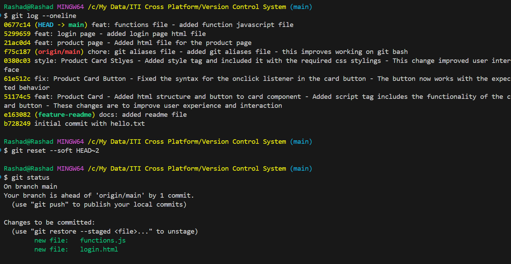
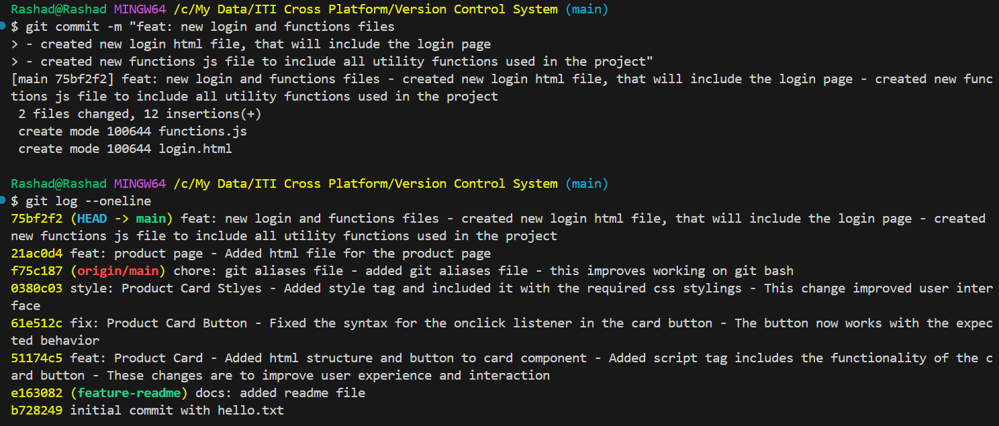
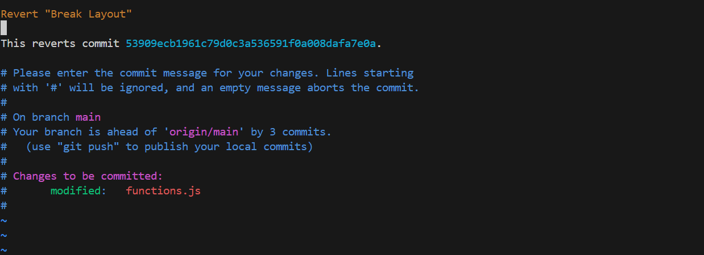
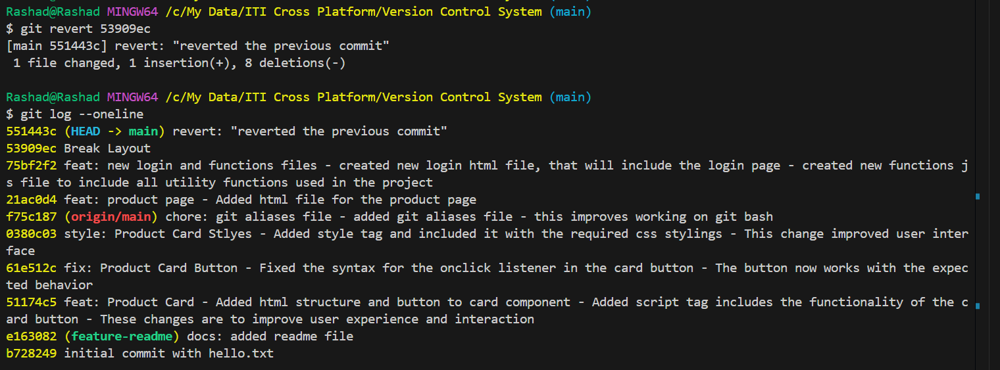
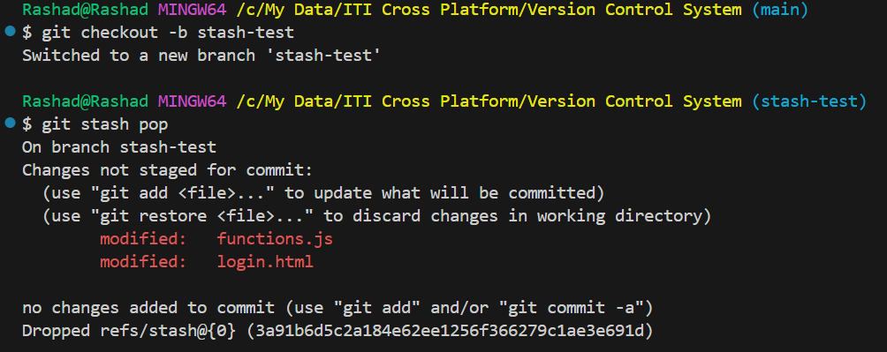
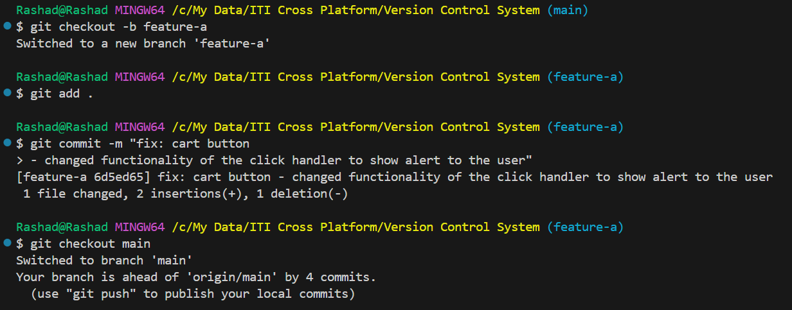
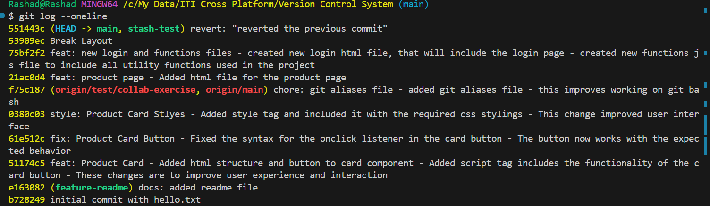
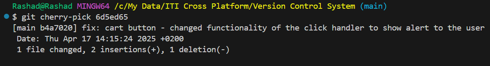
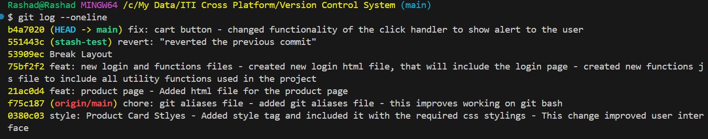

## 📝 Homework Exercises – Git Recovery & Advanced Operations

### 📌 Exercise 8: Soft Reset Practice

**Objective:** Learn how to undo commits while keeping your changes.

- Create three commits with different files.
- Use `git log` to view the history.
- Run:
  
  git reset --soft HEAD~2  to undo the last two commits but keep the changes staged.
  --> 
- Recommit with improved messages.
- Verify the new log with `git log`.

--> 
---

### 📌 Exercise 9: Revert Simulation

**Objective:** Undo a commit safely without rewriting history.

- Make a change and commit it with a message like `"Break layout"`.
- Run `git log` and copy the commit hash.
- Run:
  
  git revert <commit-hash>
  
  to create a new commit that undoes the previous one.
- Confirm the result using `git log` and check your files.

-->
-->
---

### 📌 Exercise 10: Stash Use Case

**Objective:** Temporarily save uncommitted work.

- Edit two files without committing.
- Run:
  
  git stash
  
- Switch to another branch using `git checkout`.
- After switching back, run:
  
  git stash pop
  
- Run `git status` before and after stashing to observe changes.
--> 
---

### 📌 Exercise 11: Cherry-Pick Challenge

**Objective:** Apply a commit from one branch to another.

- Create a new branch `feature-a` and commit a change.
- Switch to `main` and run:
  
  git cherry-pick <commit-hash>
  
- Use:
  
  git log --oneline
  
  to confirm the commit appears on both branches.
  
  --> 
  --> 
  --> 
  --> 

### ✅ Submission Guidelines:

- Create a GitHub repo named `git-homework`
- Push all your exercises there.
- Submit the repo link before [21/04/2025].
s